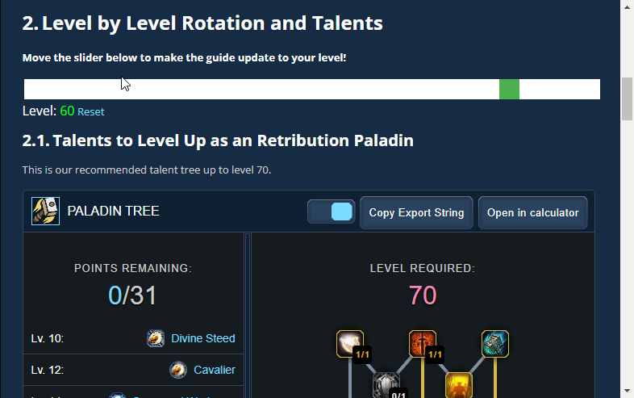

# Icy Veins Leveling Slider Reminder
Userscript that remembers the last selected level on the Icy Veins Leveling Guide sliders.

## Installation

1. Make sure you have user scripts enabled in your browser (these instructions refer to the latest versions of the browser):

	* Firefox - install [Tampermonkey](https://tampermonkey.net/?ext=dhdg&browser=firefox) or [Greasemonkey](https://addons.mozilla.org/en-US/firefox/addon/greasemonkey/).
	* Chrome - install [Tampermonkey](https://tampermonkey.net/?ext=dhdg&browser=chrome).
	* Opera - install [Tampermonkey](https://tampermonkey.net/?ext=dhdg&browser=opera) or [Violent Monkey](https://addons.opera.com/en/extensions/details/violent-monkey/).
	* Safari - install [Tampermonkey](https://tampermonkey.net/?ext=dhdg&browser=safari).
	* Dolphin - install [Tampermonkey](https://tampermonkey.net/?ext=dhdg&browser=dolphin).
	* UC Browser - install [Tampermonkey](https://tampermonkey.net/?ext=dhdg&browser=ucweb).
	
2. Get information or install:
	* Install the script directly from GitHub by clicking on [this link](https://raw.githubusercontent.com/DJScias/Icy-Veins-Leveling-Slider-Reminder/master/icy-veins-leveling-slider-reminder.user.js).
	* Install the script from [GreasyFork](https://greasyfork.org/en/scripts/404276-icy-veins-leveling-slider-reminder) (GF).
	* Or, install the script from [OpenUserJS](https://openuserjs.org/scripts/DJScias/Icy_Veins_Leveling_Slider_Reminder) (OU).

## Example GIF

